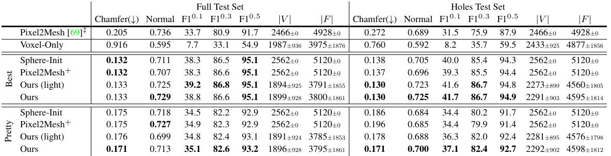
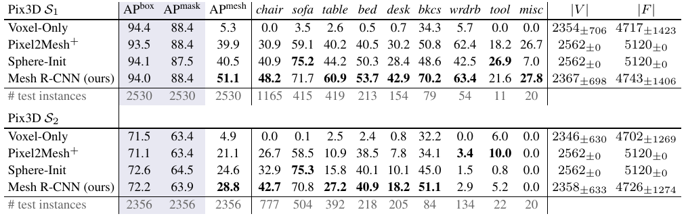

# MeshRCNN

Paper: https://arxiv.org/pdf/1906.02739.pdf

Code: https://github.com/facebookresearch/meshrcnn

input a single image, output 

- category label (from Mask R-CNN)
- bounding box (from Mask R-CNN)
- instance segmentation mask (from Mask R-CNN)
- 3D triangle mesh in camera coordinate

### ShapeNet Dataset

- 3D shapes rendering from a subset of ShapeNetCore.v1
- up to 24 random viewpoints
- RGB size is 137x137
  - train set 35,011 models (840,189)
  - test set 8,757 models (210,051)
  - validation 5% of training 

ShapeNet Evaluation is the following



### Pix3D Dataset

IKEA 395 furniture models (10,069 images), S1 and S2 are 2 types of split



### Implementation Details

Install PyTorch3D, Detectron2, and MeshRCNN

```bash
# docker environment: harbor.pxing.com/x-lab/meshrcnn_cuda111_cudnn8:v0

# For NVIDIA GeForce RTX 3090 
# environment docker_1.9.1-cuda11.1-cudnn8-devel
# install Anaconda, then

apt-get update
apt-get install ffmpeg libsm6 libxext6 

nvcc --version
# Cuda compilation tools, release 11.1, V11.1.105

conda create -n pytorch3d python=3.9
conda activate pytorch3d

# CUDA 11.1
conda install pytorch==1.8.0 torchvision==0.9.0 torchaudio==0.8.0 cudatoolkit=11.1 -c pytorch -c conda-forge
conda install -c fvcore -c iopath -c conda-forge fvcore iopath
conda install -c bottler nvidiacub

# Demos and examplesconda install jupyter
conda install jupyter
pip install scikit-image matplotlib imageio plotly opencv-python -i https://pypi.tuna.tsinghua.edu.cn/simple/

# Tests/Linting
pip install black 'isort<5' flake8 flake8-bugbear flake8-comprehensions -i https://pypi.tuna.tsinghua.edu.cn/simple/

# prebuilt binaries for PyTorch3D from Anaconda Cloud
conda install pytorch3d -c pytorch3d

# install pytorch3d
git clone https://github.com/facebookresearch/pytorch3d.git
cd pytorch3d
pip install -e .

cd tests
python3 -m unittest discover -p *.py


python3 -m unittest discover -p test_meshes.py 
'''
.........../workspace/pytorch3d/pytorch3d/structures/meshes.py:496: UserWarning: This overload of nonzero is deprecated:
        nonzero()
Consider using one of the following signatures instead:
        nonzero(*, bool as_tuple) (Triggered internally at  /opt/conda/conda-bld/pytorch_1607370172916/work/torch/csrc/utils/python_arg_parser.cpp:882.)
  index = index.nonzero()
...........
----------------------------------------------------------------------
Ran 22 tests in 1.275s

OK
'''

python3 -m unittest discover -p test_pointclouds.py
'''
........../workspace/pytorch3d/pytorch3d/structures/pointclouds.py:398: UserWarning: This overload of nonzero is deprecated:
        nonzero()
Consider using one of the following signatures instead:
        nonzero(*, bool as_tuple) (Triggered internally at  /opt/conda/conda-bld/pytorch_1607370172916/work/torch/csrc/utils/python_arg_parser.cpp:882.)
  index = index.nonzero()
.............EE.
======================================================================
ERROR: test_to_list (test_pointclouds.TestPointclouds)
----------------------------------------------------------------------
Traceback (most recent call last):
  File "/workspace/pytorch3d/tests/test_pointclouds.py", line 708, in test_to_list
    new_cloud = cloud.to(device)
  File "/workspace/pytorch3d/pytorch3d/structures/pointclouds.py", line 793, in to
    other._points_list = [v.to(device_) for v in other.points_list()]
  File "/workspace/pytorch3d/pytorch3d/structures/pointclouds.py", line 793, in <listcomp>
    other._points_list = [v.to(device_) for v in other.points_list()]
RuntimeError: CUDA error: invalid device ordinal

======================================================================
ERROR: test_to_tensor (test_pointclouds.TestPointclouds)
----------------------------------------------------------------------
Traceback (most recent call last):
  File "/workspace/pytorch3d/tests/test_pointclouds.py", line 745, in test_to_tensor
    new_cloud = cloud.to(device)
  File "/workspace/pytorch3d/pytorch3d/structures/pointclouds.py", line 793, in to
    other._points_list = [v.to(device_) for v in other.points_list()]
  File "/workspace/pytorch3d/pytorch3d/structures/pointclouds.py", line 793, in <listcomp>
    other._points_list = [v.to(device_) for v in other.points_list()]
RuntimeError: CUDA error: invalid device ordinal

----------------------------------------------------------------------
Ran 26 tests in 1.992s

FAILED (errors=2)
'''

# Install Detectron2
git clone https://github.com/facebookresearch/detectron2.git
python -m pip install -e detectron2

# Install MeshRCNN
git clone https://github.com/facebookresearch/meshrcnn.git
cd meshrcnn && pip install -e .
```

Docker files saved directory

```
root
  |----- pytorch3d
  |----- detectron2
  |----- meshrcnn  
```

Run MeshRCNN

```bash
# Download pre-trained weights
# https://github.com/facebookresearch/meshrcnn/blob/main/INSTRUCTIONS_PIX3D.md
# https://github.com/facebookresearch/meshrcnn/blob/main/INSTRUCTIONS_SHAPENET.md
# Run MeshRCNN Demo
bash run_demo.sh 
'''
python demo/demo.py \
--config-file configs/pix3d/meshrcnn_R50_FPN.yaml \
--input 000000001993.jpg \
--output output_demo \
--onlyhighest MODEL.WEIGHTS meshrcnn_S2_R50.pth
'''
```


